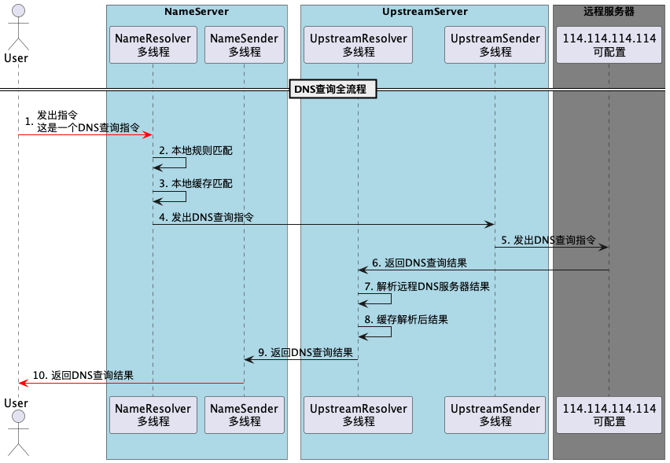
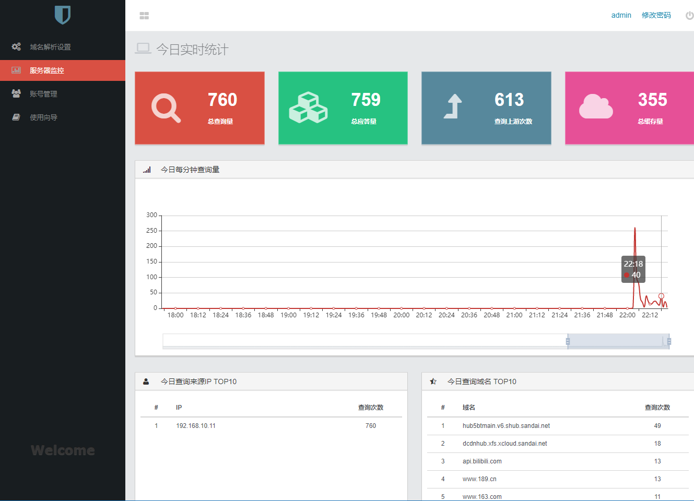
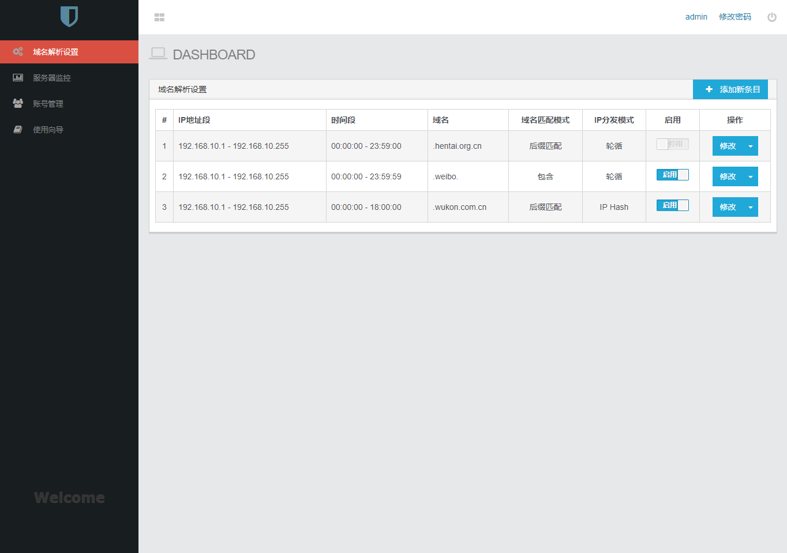
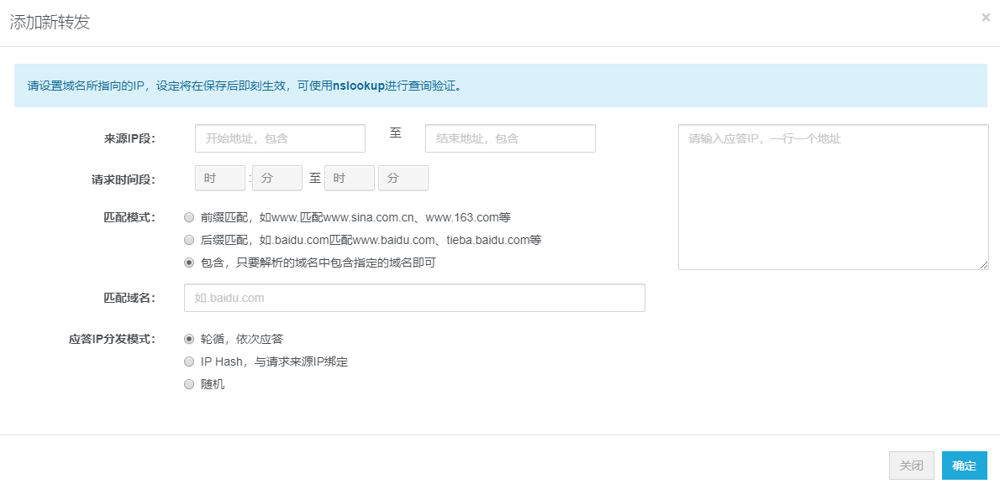

# lzc-dns
DNS服务器，又名域名解析服务器，英文名是Domain Name Server，当前项目使用了Java语言基本上完整了实现了一套DNS数据包接收、解析、发送等功能，完全开源

本项目实现了一个功能较全面的DNS服务器，可以通过WEB端的管理界面，达到如下目的：
1. 基本的DNS服务器，本服务器实现将通过询问上游DNS服务器来完成对规则外域名的解析应答，通过缓存共用，能够有效的加快域名解析的速度。
2. 企业内部云的DNS支持，实现内部域名的解析、CDN模拟、域名层面的负载均衡。
3. 上网行为控制，通过将指定域名的IP解析到127.0.0.1等不可达或不正确的IP上来实现网站屏蔽。
4. 内部带宽控制，通过将指定域名的IP解析到一个HTTP代理缓存服务器上，实现流量复用。




# 启动
1. 查看并修改好配置文件`application.properties`，按配置文件里的库名和用户名密码创建好，或使用现成的数据库账号，使用`/doc/1.2-init-table.sql`数据库建表脚本创建好相应的表
2. 配置文件里的`dns.upstream.server.address`为上游DNS服务器地址，将为本DNS服务器提供递归解析能力，当遇到本地解析规则所不支持的域名时，将向上游DNS服务器进行查询并回应。
3. 使用`mvn package`打包后直接用`java -jar lzc-dns-1.0.0-SNAPSHOT.jar`启动。
4. 或是直接在IDE中启动主入口程序`cn.org.hentai.dns.app.DNSCheaterAPP`。
5. 此时可以登陆网页管理控制台，默认为`http://localhost`（如果你是本机运行的话）。
6. 管理控制台的账号在`1.2-init-table.sql`里已经准备好了一个，用户名为`admin`，密码为`123456`。

#测试
## dig测试工具的使用
1.在命令行中直接输入以下命令即可进行测试
dig @127.0.0.1 baidu.com a
2.如果想一次性测试更多的命令可以见准备好的文件`/doc/dns_test_case.txt`

## nslookup测试工具的使用
1. 打开`命令提示符`或是直接运行`cmd`。
2. 输入`nslookup`，进入DNS测试工具的命令行交互环境。（可以输入`set d2`来启用高级调试模式，输入`help`查看更多帮助）
3. 输入`server {我的IP}`来将DNS服务器设置为你所运行的主机的IP地址。
4. 输入`www.baidu.com`，查看响应的IP。此时已经可以在`WEB管理控制台`下的`服务器监控`下看到实时的请求统计了。

# 界面截图
## 实时监控



## DNS条目管理


## 添加新解析规则


# 联系作者
本项目纯用作学习用途，欢迎加作者微信```lzc_java```进行交流